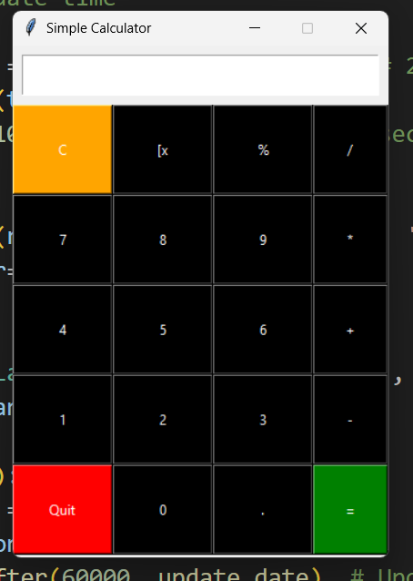

# Simple Calculator (Tkinter GUI)

A **simple calculator** built using Python's **Tkinter** library. This calculator supports basic arithmetic operations, percentage calculation, backspace, and clearing the input. It comes with an interactive GUI that makes calculations easy and fast.  

---

## Features

- Addition, Subtraction, Multiplication, Division
- Percentage calculations (`%`)
- Clear input (`C`)
- Backspace functionality (`[x`)
- Exit option (`Quit`)
- User-friendly interface using Tkinter

---

## Screenshot



---

## Installation

1. Make sure you have **Python 3.x** installed on your system.
2. Tkinter is included with standard Python installations. If not, install it using:

    ```bash
    pip install tk
    ```
3. Clone or download this repository.

    ```bash
    git clone https://github.com/CodeByAshuu/pyTkinter.git
    ```
4. Navigate to the project folder in your terminal.

## Usage
Run the calculator using:
    ```bash
    python calculator.py
    ```

Click the buttons to perform operations.

- C → Clears the input.
- [x → Deletes the last character (backspace).
- = → Calculates the result.
- Quit → Exits the application.

## Notes

The calculator handles division by zero and invalid operations gracefully by showing "Error".

Works on Windows, macOS, and Linux.