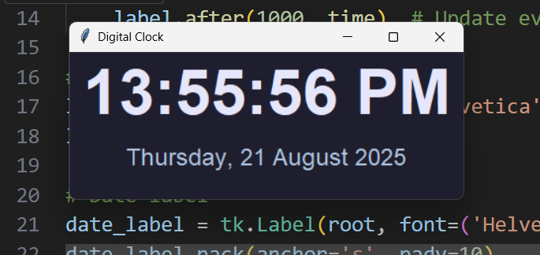

# Digital Clock (Tkinter)

A **minimalistic and modern digital clock** built using Python's Tkinter library.  
Displays the current time and date with a sleek, clean design.

---

## 🖥️ Screenshot



---

## ⚡ Features

- Real-time digital clock with hours, minutes, and seconds.
- Displays current date below the time.
- Minimalistic, modern design with dark theme and soft text colors.
- Updates automatically every second (time) and every minute (date).

---

## 🛠️ Technologies Used

- Python 3
- Tkinter (built-in GUI library)
- time
---

## 🚀 How to Run

1. Clone or download the repository.  
2. Make sure Python 3 is installed.  
3. Open terminal/command prompt in the project directory.  
4. Run the script:

    ```bash
    python digitalClock.py
    ```

5. Enjoy your digital clock